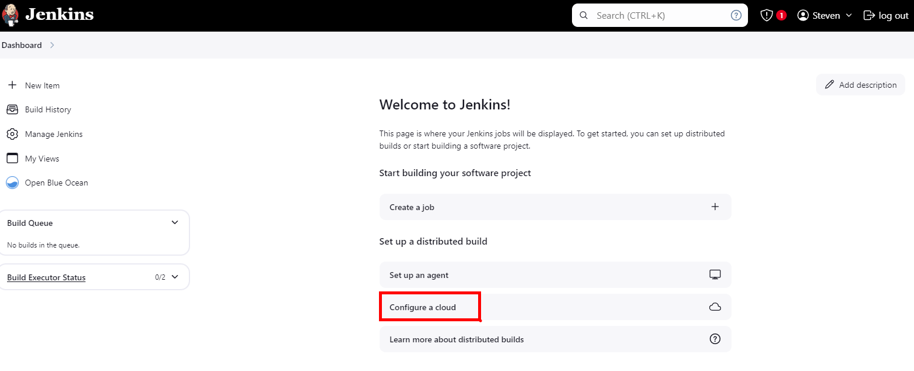
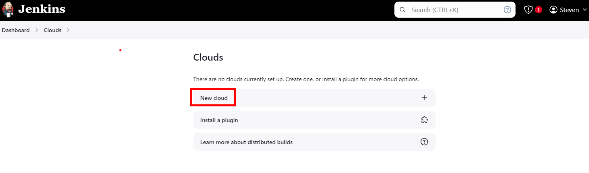
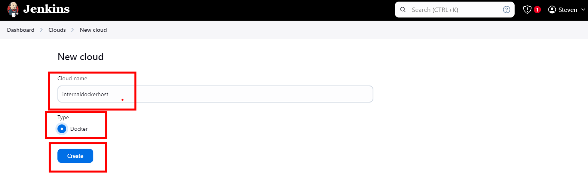
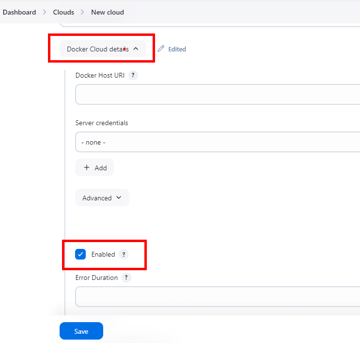

# Exercise 2: Configure Jenkins

In this exercise, we'll learn to configure Jenkins.

To accomplish this, we'll configure Jenkins using the WEBUI to talk to our Docker Desktop

### Setup Jenkins containers

Once you have logged into Jenkins with your username, you need to set the Docker Agent ( for Build )
>> First, we setup the agent, follow these steps to setup the agents properly

1. Navigate to Configure a Cloud

2. Setup New Cloud 

3. Set the Cloud Name and Select Docker and Click Create

4. In the new Cloud Windows, select Docker Cloud Details, and select Enabled and Save it

5. 

