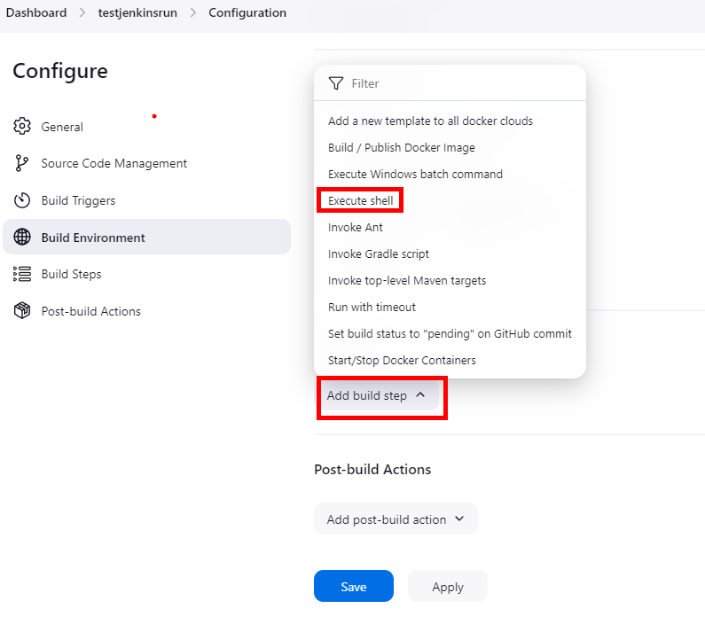
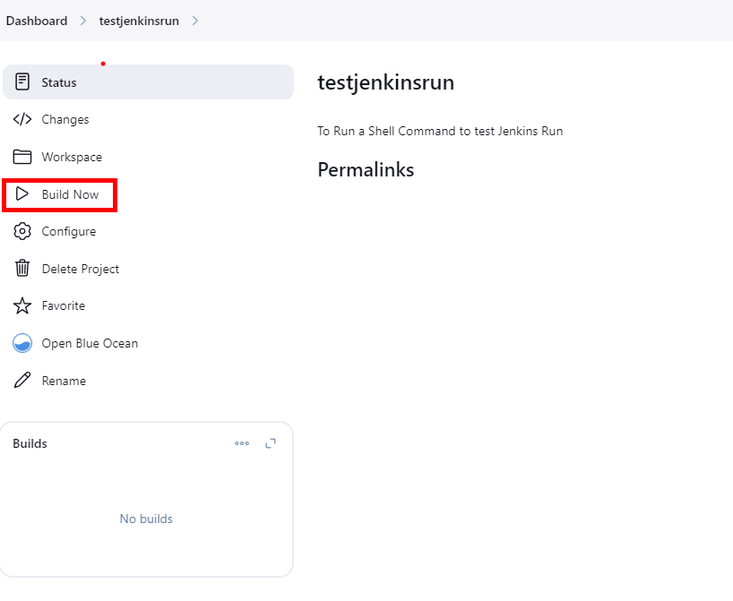

# Exercise 3: Jenkins Pipeline

In this exercise, we'll learn to deploy simple pipeline that will deploy a container.

To accomplish this, we'll build Jenkins Pipeline and run it and verify it

### Setup Jenkins pipeline

1. Click on Dashboard, if you are not there, then click + New Item

2. Name your project and click freesytle project

3. In the General Screen Fill in the Description as **To Run a Shell Command to test Jenkins Run** 

4. Under the General Scroll to Build Steps and Select Execute Shell 

5. In the command Shell insert the following: 
**echo "Hello World Test"** and hit Save

6. In the following screen select Build Now:

7. Once the build is finish, select the Build View and select Console Output: 

8. Your Console output should show, its Finished Successfully 